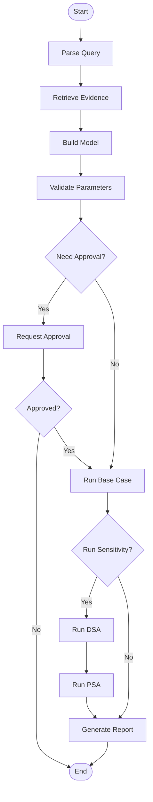

# AI Agentic Framework Guide

## Overview

The Health Economic Modeling Hub includes an advanced AI agentic framework that integrates **CrewAI** for agent orchestration and **LangGraph** for workflow management. This framework enables automated, augmented, and assisted analysis workflows.

## Architecture

### Components

```
ai/
├── __init__.py           # Package initialization
├── state.py              # LangGraph state management
├── nodes.py              # LangGraph node functions
├── graph.py              # LangGraph workflow orchestration
└── crew/
    ├── __init__.py       # Crew package initialization
    ├── agents.py         # CrewAI agent definitions
    ├── tasks.py          # CrewAI task definitions
    ├── crew.py           # Crew orchestration
    └── tools.py          # Custom tools for agents
```

### Integration Flow

```
User Query → LangGraph Workflow → CrewAI Agents → Tools → Results
     ↓              ↓                    ↓          ↓        ↓
   State      Node Functions        Agent Tasks  Actions  Update State
```

## CrewAI Agents

The framework includes 8 specialized agents:

### 1. Query Parser Agent
- **Role:** Health Economics Query Parser
- **Goal:** Extract structured information from user queries
- **Capabilities:** 
  - Identify disease area, intervention, comparator
  - Recommend appropriate model type
  - Extract time horizon and perspective

### 2. Literature Researcher Agent
- **Role:** Clinical Literature Researcher
- **Goal:** Find high-quality evidence for model parameters
- **Tools:** LiteratureSearchTool
- **Capabilities:**
  - Search health economics databases
  - Extract parameter estimates with uncertainty
  - Assess study quality
  - Identify missing parameters

### 3. Model Builder Agent
- **Role:** Health Economic Model Architect
- **Goal:** Design and build model structures
- **Tools:** ModelValidationTool
- **Capabilities:**
  - Create decision trees, Markov models, PSM models
  - Structure health states and transitions
  - Populate parameters
  - Apply best practices

### 4. Parameter Validator Agent
- **Role:** Model Parameter Validator
- **Goal:** Validate parameters for consistency and plausibility
- **Tools:** ParameterValidationTool
- **Capabilities:**
  - Check mathematical consistency
  - Verify clinical plausibility
  - Ensure completeness
  - Generate validation reports

### 5. Analysis Executor Agent
- **Role:** Health Economic Analysis Specialist
- **Goal:** Execute analyses and interpret results
- **Tools:** CalculationTool
- **Capabilities:**
  - Run base case analyses
  - Execute DSA and PSA
  - Calculate ICER, NMB, CEAC
  - Apply discounting

### 6. Report Generator Agent
- **Role:** Health Economics Report Writer
- **Goal:** Generate comprehensive analysis reports
- **Tools:** ReportGeneratorTool
- **Capabilities:**
  - Follow CHEERS guidelines
  - Structure executive summaries
  - Document methods and results
  - Provide recommendations

### 7. Quality Assurance Agent
- **Role:** Health Economics QA Specialist
- **Goal:** Perform comprehensive quality checks
- **Capabilities:**
  - Verify technical accuracy
  - Check face validity
  - Cross-validate results
  - Compare to benchmarks

### 8. AI Coordinator Agent
- **Role:** AI Workflow Coordinator
- **Goal:** Coordinate agents based on AI mode
- **Capabilities:**
  - Adapt behavior to AI mode
  - Delegate tasks appropriately
  - Manage workflow transitions

## LangGraph Workflow

### State Management

The workflow uses a comprehensive `HealthEconState` that tracks:

```python
{
    'user_query': str,           # Original user query
    'ai_mode': str,              # ai-assisted | ai-augmented | ai-automated
    'model_type': str,           # decision_tree | markov | psm
    'project_id': str,           # Unique project identifier
    'disease_area': str,         # e.g., "cardiovascular disease"
    'intervention': str,         # e.g., "Novel drug X"
    'comparator': str,           # e.g., "Standard of care"
    'parameters': dict,          # Model parameters with uncertainty
    'time_horizon': int,         # Years
    'discount_rate_cost': float, # Cost discount rate
    'discount_rate_qaly': float, # QALY discount rate
    'wtp_threshold': float,      # Willingness-to-pay threshold
    'model_structure': dict,     # States, transitions, etc.
    'literature_evidence': list, # Sources and citations
    'parameter_suggestions': list,
    'validation_results': dict,  # Errors, warnings, suggestions
    'base_case_results': dict,   # Costs, QALYs, ICER, NMB
    'dsa_results': dict,         # Tornado diagram data
    'psa_results': dict,         # Scatter plot, CEAC data
    'ceac_data': dict,           # Cost-effectiveness acceptability curve
    'messages': list,            # Informational messages
    'warnings': list,            # Warnings to user
    'suggestions': list,         # AI suggestions
    'current_step': str,         # Current workflow step
    'requires_user_approval': bool,
    'user_approved': bool,
    'should_continue': bool,
    'final_report': str,         # Markdown report
    'charts': dict,              # Chart data
    'icer': float,               # Final ICER value
    'nmb': float,                # Net monetary benefit
    'created_at': str,           # ISO timestamp
    'updated_at': str,           # ISO timestamp
    'execution_time': float      # Seconds
}
```

### Workflow Steps



### Node Functions

Each node in the workflow:

1. **Parse Query Node**
   - Extracts requirements from user query
   - Calls QueryParser agent
   - Updates state with project metadata

2. **Retrieve Evidence Node**
   - Searches literature for parameters
   - Calls LiteratureResearcher agent
   - Updates state with evidence and sources

3. **Build Model Node**
   - Creates model structure
   - Calls ModelBuilder agent
   - Populates parameters

4. **Validate Parameters Node**
   - Checks for errors and warnings
   - Calls ParameterValidator agent
   - Determines if approval needed

5. **Request Approval Node**
   - Pauses workflow in assisted/augmented modes
   - Presents validation results to user
   - Waits for user decision

6. **Run Base Case Node**
   - Executes base case analysis
   - Calls AnalysisExecutor agent
   - Calculates ICER and NMB

7. **Run DSA Node**
   - Performs deterministic sensitivity analysis
   - Generates tornado diagram data

8. **Run PSA Node**
   - Performs probabilistic sensitivity analysis
   - Generates scatter plot and CEAC data

9. **Generate Report Node**
   - Creates comprehensive markdown report
   - Calls ReportGenerator agent
   - Follows CHEERS guidelines

10. **End Node**
    - Finalizes workflow
    - Returns complete results

### Conditional Routing

The workflow includes conditional edges:

1. **After Validation** (`_route_after_validation`)
   - If `requires_user_approval` → go to Request Approval
   - Otherwise → proceed to Base Case

2. **After Approval** (`_route_after_approval`)
   - If `user_approved` → proceed to Base Case
   - Otherwise → end workflow

3. **After Base Case** (`_route_after_base_case`)
   - If `ai_mode == "ai-automated"` → run sensitivity analyses
   - Otherwise → generate report directly

## Custom Tools

### LiteratureSearchTool
- Searches health economics databases
- Returns parameter estimates with uncertainty
- Provides source citations
- *Production: Integrate with PubMed API, Cochrane, CEA Registry*

### ParameterValidationTool
- Validates parameter ranges
- Checks mathematical consistency
- Verifies clinical plausibility
- Returns errors and warnings

### CalculationTool
- Performs health economics calculations
- Supports base case, DSA, PSA
- Applies discounting
- Generates ICER, NMB, CEAC

### ModelValidationTool
- Validates model structure
- Checks state definitions
- Verifies transition matrices
- Ensures completeness

### ReportGeneratorTool
- Generates markdown reports
- Follows CHEERS guidelines
- Includes executive summary, methods, results
- Publication-ready format

## Usage Examples

### Basic Workflow Execution

```python
from ai.graph import HealthEconGraph

# Initialize workflow
graph = HealthEconGraph(ai_mode="ai-augmented")

# Run complete workflow
result = graph.run(
    user_query="Evaluate cost-effectiveness of Drug X vs standard care for Type 2 Diabetes"
)

# Access results
print(f"ICER: ${result['icer']:,.2f} per QALY")
print(f"Report:\n{result['final_report']}")
```

### Interactive Workflow (with approval)

```python
# Run until approval checkpoint
result = graph.run_until_approval(
    user_query="CEA for new heart failure treatment"
)

# Present to user
print("Validation Results:")
print(f"Errors: {result['validation_results']['errors']}")
print(f"Warnings: {result['validation_results']['warnings']}")

# User reviews and approves
user_decision = input("Approve? (yes/no): ")

# Resume workflow
if user_decision.lower() == 'yes':
    final_result = graph.resume_after_approval(result, approved=True)
else:
    final_result = graph.resume_after_approval(result, approved=False)
```

### Visualize Workflow

```python
# Generate Mermaid diagram
mermaid_code = graph.visualize()
print(mermaid_code)
```

## AI Mode Behavior

### AI-Assisted Mode
- Provides parameter suggestions
- Requires user approval before analysis
- Minimal automation
- User maintains full control

### AI-Augmented Mode
- Auto-fills some parameters
- Requires approval for major decisions
- Moderate automation
- Collaborative approach

### AI-Automated Mode
- Auto-fills all parameters
- No approval checkpoints
- Runs full analysis pipeline (base + DSA + PSA)
- Maximum automation

## Integration with Dash Application

### From Callbacks

```python
from ai.graph import HealthEconGraph

@app.callback(
    Output('analysis-results', 'data'),
    Input('run-ai-button', 'n_clicks'),
    State('user-query', 'value'),
    State('ai-mode-store', 'data')
)
def run_ai_analysis(n_clicks, query, ai_mode):
    if not n_clicks:
        return no_update
    
    # Initialize workflow with current AI mode
    graph = HealthEconGraph(ai_mode=ai_mode)
    
    # Run workflow
    result = graph.run(user_query=query)
    
    return result
```

### Storing Results

```python
# Save to database
from data.database import create_project, update_project

project_id = create_project(
    name=result['project_name'],
    model_type=result['model_type'],
    disease_area=result['disease_area']
)

update_project(
    project_id=project_id,
    base_case_results=result['base_case_results'],
    dsa_results=result['dsa_results'],
    psa_results=result['psa_results']
)
```

## Environment Setup

### Required API Keys

Set in `.env` file:

```bash
# OpenAI API (for LangChain LLMs)
OPENAI_API_KEY=sk-...

# Optional: Other LLM providers
ANTHROPIC_API_KEY=...
COHERE_API_KEY=...

# Optional: Literature search APIs
PUBMED_API_KEY=...
```

### Installation

```bash
pip install -r requirements-dash.txt
```

## Best Practices

### 1. State Management
- Always use `create_initial_state()` to initialize
- Update state immutably (return new dict)
- Validate state before passing to nodes

### 2. Agent Design
- Keep agents focused on single responsibilities
- Provide clear goals and backstories
- Limit iterations (`max_iter`) to avoid loops

### 3. Tool Implementation
- Return structured JSON from tools
- Handle errors gracefully
- Include validation in tools

### 4. Workflow Design
- Use conditional edges for branching logic
- Implement approval checkpoints in assisted/augmented modes
- Provide clear status updates

### 5. Error Handling
- Catch exceptions in node functions
- Store errors in state
- Provide fallback behaviors

## Testing

### Unit Tests

```python
import pytest
from ai.state import create_initial_state
from ai.nodes import HealthEconNodes

def test_parse_query_node():
    nodes = HealthEconNodes(ai_mode="ai-assisted")
    state = create_initial_state(
        user_query="Evaluate Drug X for diabetes"
    )
    
    result = nodes.parse_query_node(state)
    
    assert result['disease_area'] == 'diabetes'
    assert result['model_type'] in ['decision_tree', 'markov', 'psm']
```

### Integration Tests

```python
def test_full_workflow():
    from ai.graph import HealthEconGraph
    
    graph = HealthEconGraph(ai_mode="ai-automated")
    result = graph.run(
        user_query="CEA for new oncology treatment"
    )
    
    assert 'icer' in result
    assert 'final_report' in result
    assert result['current_step'] == 'end'
```

## Future Enhancements

### Planned Features
1. **Real Literature Search**: Integrate with PubMed, Cochrane APIs
2. **Advanced Models**: Support microsimulation, DES
3. **Multi-Criteria Decision Analysis**: Beyond cost-effectiveness
4. **Collaborative Features**: Multi-user workflows with version control
5. **Model Calibration**: Automatic parameter fitting
6. **External Validation**: Compare to published benchmarks

### Potential Integrations
- **R Integration**: Use R packages (heemod, dampack) via rpy2
- **Excel Import/Export**: TreeAge, WinBUGS file formats
- **HTA Guidelines**: Automatic compliance checking (NICE, CADTH, ICER)

## Troubleshooting

### Common Issues

**Issue:** Agents not responding
- **Solution:** Check API keys in `.env`
- **Solution:** Verify internet connection for LLM API calls

**Issue:** Workflow stuck at approval
- **Solution:** Ensure `user_approved` is set before `resume_after_approval()`
- **Solution:** Check conditional routing logic

**Issue:** Parameter validation failing
- **Solution:** Review parameter ranges and types
- **Solution:** Check for missing required parameters

**Issue:** Calculations returning zeros
- **Solution:** Verify parameters are populated
- **Solution:** Check CalculationTool implementation

## Support

For issues or questions:
1. Check this guide and `AI_MODES_GUIDE.md`
2. Review code comments in `ai/` directory
3. Examine example usage in test files
4. Consult CrewAI documentation: https://docs.crewai.com
5. Consult LangGraph documentation: https://langchain-ai.github.io/langgraph

## References

- **CrewAI:** Framework for orchestrating role-playing AI agents
- **LangGraph:** Framework for building stateful, multi-actor applications with LLMs
- **LangChain:** Framework for developing applications powered by language models
- **ISPOR-SMDM Guidelines:** Modeling good research practices
- **CHEERS Statement:** Reporting standards for health economic evaluations
