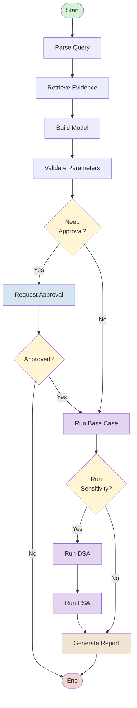

# AI Agentic Framework

> **CrewAI + LangGraph** integration for automated health economic analysis

## Quick Start

```python
from ai.graph import HealthEconGraph

# Create workflow in automated mode
graph = HealthEconGraph(ai_mode="ai-automated")

# Run complete analysis
result = graph.run(
    user_query="Evaluate cost-effectiveness of Drug X vs standard care for Type 2 Diabetes"
)

# Access results
print(f"ICER: ${result['icer']:,.2f} per QALY")
print(f"NMB: ${result['nmb']:,.2f}")
print(result['final_report'])
```

## What This Does

The AI framework automates the complete health economic analysis pipeline:

1. **Parse Query** → Extract disease area, intervention, comparator, model type
2. **Retrieve Evidence** → Search literature for parameters
3. **Build Model** → Create decision tree, Markov, or PSM structure
4. **Validate** → Check parameters for consistency and plausibility
5. **Approval** → Pause for user review (if in assisted/augmented mode)
6. **Base Case** → Calculate costs, QALYs, ICER, NMB
7. **DSA** → Deterministic sensitivity analysis (tornado diagram)
8. **PSA** → Probabilistic sensitivity analysis (scatter plot, CEAC)
9. **Report** → Generate CHEERS-compliant markdown report

## Structure

```
ai/
├── state.py       # State management (HealthEconState with 30+ fields)
├── nodes.py       # 10 node functions (one per workflow step)
├── graph.py       # LangGraph workflow with conditional routing
└── crew/
    ├── agents.py  # 8 specialized agents (parser, researcher, builder, etc.)
    ├── tasks.py   # 8 task definitions (parse, research, build, etc.)
    ├── crew.py    # HealthEconCrew orchestration
    └── tools.py   # 5 custom tools (search, validation, calculation, etc.)
```

## AI Modes

### AI-Assisted
```python
graph = HealthEconGraph(ai_mode="ai-assisted")
```
- Provides suggestions only
- Requires approval at multiple checkpoints
- User maintains full control
- Ideal for learning or sensitive analyses

### AI-Augmented
```python
graph = HealthEconGraph(ai_mode="ai-augmented")
```
- Auto-fills some parameters from literature
- Requires approval before running analysis
- Collaborative approach
- Balance of automation and control

### AI-Automated
```python
graph = HealthEconGraph(ai_mode="ai-automated")
```
- Auto-fills all parameters
- No approval checkpoints
- Runs complete pipeline (base + DSA + PSA)
- Maximum automation

## Key Components

### LangGraph Workflow (`graph.py`)

Orchestrates the complete analysis pipeline with:
- **10 nodes** (parse, retrieve, build, validate, approve, base, dsa, psa, report, end)
- **Conditional routing** (approval logic, sensitivity analysis branching)
- **State management** (30+ fields tracking entire lifecycle)
- **Resumable execution** (pause/resume at approval checkpoints)

### CrewAI Agents (`crew/agents.py`)

8 specialized agents with domain expertise:
1. **Query Parser** - Extract structured requirements
2. **Literature Researcher** - Find evidence and parameters
3. **Model Builder** - Design appropriate model structures
4. **Parameter Validator** - Check consistency and plausibility
5. **Analysis Executor** - Run base case, DSA, PSA
6. **Report Generator** - Create CHEERS-compliant reports
7. **Quality Assurance** - Validate technical accuracy
8. **AI Coordinator** - Adapt behavior to AI mode

### Custom Tools (`crew/tools.py`)

5 domain-specific tools:
- **LiteratureSearchTool** - Search health economics databases
- **ParameterValidationTool** - Validate ranges and consistency
- **CalculationTool** - ICER, NMB, discounting, CEAC calculations
- **ModelValidationTool** - Check model structure completeness
- **ReportGeneratorTool** - Generate formatted markdown reports

## Usage Examples

### Example 1: Complete Workflow

```python
from ai.graph import HealthEconGraph

graph = HealthEconGraph(ai_mode="ai-automated")

result = graph.run(
    user_query="Cost-effectiveness of novel anticoagulant vs warfarin for atrial fibrillation"
)

# Results include:
# - Parsed requirements (disease_area, intervention, comparator)
# - Literature evidence (parameters with sources)
# - Model structure (states, transitions)
# - Validation results (errors, warnings, suggestions)
# - Base case results (costs, QALYs, ICER, NMB)
# - DSA results (tornado diagram data)
# - PSA results (scatter plot, CEAC)
# - Final report (markdown, CHEERS-compliant)
```

### Example 2: Interactive with Approval

```python
graph = HealthEconGraph(ai_mode="ai-augmented")

# Run until approval is needed
result = graph.run_until_approval(
    user_query="Evaluate immunotherapy for non-small cell lung cancer"
)

# Present validation results to user
print(f"Errors: {result['validation_results']['errors']}")
print(f"Warnings: {result['validation_results']['warnings']}")

# User reviews and decides
user_approved = True  # or False based on review

# Resume workflow
if user_approved:
    final_result = graph.resume_after_approval(result, approved=True)
    print(f"ICER: ${final_result['icer']:,.2f} per QALY")
else:
    print("Analysis cancelled by user")
```

### Example 3: Single Task Execution

```python
from ai.crew.crew import HealthEconCrew

crew = HealthEconCrew(ai_mode="ai-augmented")

# Run just the literature search
lit_result = crew.run_literature_research_task(
    disease_area="cardiovascular disease",
    intervention="PCSK9 inhibitor",
    comparator="Statin therapy",
    model_type="markov"
)

print(f"Found {len(lit_result['parameters'])} parameters")
print(f"Sources: {lit_result['sources']}")
print(f"Missing: {lit_result['missing_parameters']}")
```

### Example 4: Integration with Dash

```python
from dash import callback, Input, Output, State
from ai.graph import HealthEconGraph

@callback(
    Output('ai-results', 'data'),
    Input('run-ai-button', 'n_clicks'),
    State('user-query', 'value'),
    State('ai-mode-store', 'data')  # From header dropdown
)
def run_ai_analysis(n_clicks, query, ai_mode):
    if not n_clicks:
        return {}
    
    graph = HealthEconGraph(ai_mode=ai_mode)
    result = graph.run(user_query=query)
    
    return {
        'icer': result['icer'],
        'nmb': result['nmb'],
        'report': result['final_report'],
        'charts': result['charts']
    }
```

## State Structure

The workflow maintains comprehensive state:

```python
{
    # Query & Mode
    'user_query': str,
    'ai_mode': str,  # ai-assisted | ai-augmented | ai-automated
    
    # Project Info
    'project_id': str,
    'project_name': str,
    'disease_area': str,
    'intervention': str,
    'comparator': str,
    
    # Model Specification
    'model_type': str,  # decision_tree | markov | psm
    'time_horizon': int,
    'discount_rate_cost': float,
    'discount_rate_qaly': float,
    'wtp_threshold': float,
    
    # Parameters
    'parameters': dict,  # {param_name: {value, ci, source, quality}}
    
    # Model Structure
    'model_structure': dict,  # States, transitions, etc.
    
    # Evidence
    'literature_evidence': list,  # [{author, year, journal, params}]
    
    # Validation
    'validation_results': {
        'errors': list,
        'warnings': list,
        'suggestions': list,
        'is_valid': bool,
        'has_warnings': bool
    },
    
    # Analysis Results
    'base_case_results': {
        'intervention_cost': float,
        'intervention_qalys': float,
        'comparator_cost': float,
        'comparator_qalys': float,
        'incremental_cost': float,
        'incremental_qalys': float,
        'icer': float,
        'nmb': float
    },
    'dsa_results': {
        'tornado_data': [...],
        'most_sensitive': [...]
    },
    'psa_results': {
        'simulations': [...],
        'scatter_data': {...},
        'ceac_data': {...}
    },
    
    # Workflow Control
    'current_step': str,
    'requires_user_approval': bool,
    'user_approved': bool,
    'should_continue': bool,
    
    # Outputs
    'final_report': str,  # Markdown
    'charts': dict,
    'icer': float,
    'nmb': float,
    
    # Metadata
    'messages': list,
    'warnings': list,
    'suggestions': list,
    'created_at': str,
    'updated_at': str,
    'execution_time': float
}
```

## Setup

### 1. Install Dependencies

```bash
pip install -r requirements-dash.txt
```

Required packages:
- `crewai` - Multi-agent orchestration
- `langgraph` - Workflow management
- `langchain` - LLM framework
- `langchain-openai` - OpenAI integration
- `crewai-tools` - Tool base classes

### 2. Set API Keys

Create `.env` file:

```bash
OPENAI_API_KEY=sk-...
```

### 3. Test Installation

```bash
python example_ai_usage.py
```

Should see 5 examples demonstrating different usage patterns.

## Documentation

- **AI_FRAMEWORK_GUIDE.md** - Comprehensive guide (2,500+ lines)
  - Architecture deep-dive
  - Agent descriptions
  - Task definitions
  - Workflow logic
  - Tool implementations
  - Best practices
  - Testing strategies
  - Troubleshooting

- **AI_IMPLEMENTATION_SUMMARY.md** - Implementation overview
  - What was built
  - Component details
  - Integration patterns
  - Next steps

- **example_ai_usage.py** - Working examples
  - Automated workflow
  - Interactive workflow
  - Assisted workflow
  - Visualization
  - Direct crew usage

## Workflow Visualization



## Testing

### Run Examples

```bash
# All examples
python example_ai_usage.py

# Or import and run specific examples
python -c "from example_ai_usage import example_automated_workflow; example_automated_workflow()"
```

### Unit Tests

```python
import pytest
from ai.state import create_initial_state
from ai.nodes import HealthEconNodes

def test_state_creation():
    state = create_initial_state(user_query="Test")
    assert state['user_query'] == "Test"
    assert state['ai_mode'] == "ai-assisted"

def test_parse_query():
    nodes = HealthEconNodes(ai_mode="ai-assisted")
    state = create_initial_state(user_query="Evaluate Drug X for diabetes")
    result = nodes.parse_query_node(state)
    assert 'disease_area' in result
```

### Integration Tests

```python
def test_complete_workflow():
    from ai.graph import HealthEconGraph
    
    graph = HealthEconGraph(ai_mode="ai-automated")
    result = graph.run(user_query="CEA for new treatment")
    
    assert 'icer' in result
    assert 'final_report' in result
    assert result['current_step'] == 'end'
```

## Future Enhancements

### Short-Term
- [ ] Real literature API integration (PubMed, Cochrane)
- [ ] Streaming progress updates
- [ ] Enhanced error messages
- [ ] Parameter suggestion refinement

### Medium-Term
- [ ] Microsimulation model support
- [ ] Discrete event simulation
- [ ] Time-dependent transitions
- [ ] Advanced PSA methods (EVPI, EVPPI)

### Long-Term
- [ ] Model calibration engine
- [ ] External validation system
- [ ] Multi-criteria decision analysis
- [ ] Collaborative features
- [ ] Version control for models

## Troubleshooting

### Import Errors

**Problem:** `Import "crewai" could not be resolved`

**Solution:**
```bash
pip install -r requirements-dash.txt
```

### API Key Issues

**Problem:** `OpenAI API key not found`

**Solution:**
1. Create `.env` file
2. Add: `OPENAI_API_KEY=sk-...`
3. Restart application

### Workflow Stuck

**Problem:** Workflow doesn't complete

**Solution:**
- Check `current_step` in result
- If at approval, use `resume_after_approval()`
- Review conditional routing logic
- Check for errors in `validation_results`

### Agent Errors

**Problem:** Agents returning errors or empty results

**Solution:**
- Verify API key is valid
- Check internet connection
- Review agent task descriptions
- Check tool implementations
- Enable verbose mode for debugging

## Support

For help:
1. Check **AI_FRAMEWORK_GUIDE.md** for detailed documentation
2. Review **example_ai_usage.py** for working code
3. Consult **AI_IMPLEMENTATION_SUMMARY.md** for overview
4. Visit CrewAI docs: https://docs.crewai.com
5. Visit LangGraph docs: https://langchain-ai.github.io/langgraph

## License

Same as parent project.

## Contributing

When adding new features:
1. Add agents to `crew/agents.py`
2. Define tasks in `crew/tasks.py`
3. Create tools in `crew/tools.py`
4. Add nodes to `nodes.py`
5. Update workflow in `graph.py`
6. Update state in `state.py`
7. Document in `AI_FRAMEWORK_GUIDE.md`
8. Add examples to `example_ai_usage.py`

---

**Built with:**
- 🤖 CrewAI 0.86.0 - Multi-agent orchestration
- 🔀 LangGraph 0.2.62 - Workflow management
- 🔗 LangChain 0.3.13 - LLM framework
- 🛠️ Custom health economics tools
